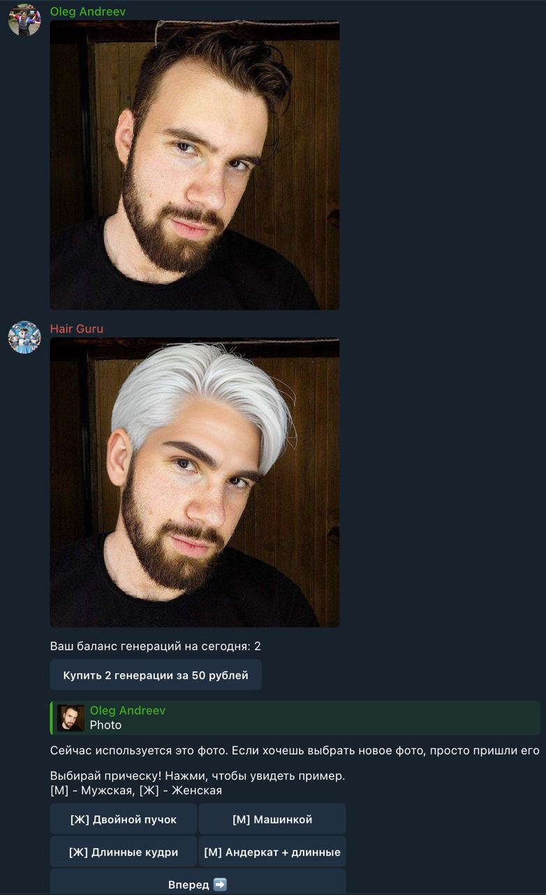

# HairStyleBot

Telegram-бот для примерки причёсок с помощью ИИ. Пользователь отправляет своё фото — бот генерирует изображение с выбранной причёской и цветом волос.

## Как это работает

1. Пользователь отправляет селфи
2. Выбирает причёску из 50+ вариантов (с превью каждого стиля)
3. Выбирает цвет волос из 21 варианта
4. Бот генерирует результат через [AiLab API](https://www.ailabapi.com/)



Каждому пользователю доступно **2 бесплатные генерации**. Дальнейшие — через YooKassa (50 ₽ за 2 генерации).

## Стек

- [aiogram 3](https://docs.aiogram.dev/) — Telegram Bot API
- [AiLab API](https://www.ailabapi.com/) — hairstyle-editor-pro (async tasks)
- [YooKassa](https://yookassa.ru/developers) — приём платежей
- [Pillow](https://pillow.readthedocs.io/) — блюр превью до оплаты

## Запуск

```bash
pip install -r requirements.txt
cp .env.example .env
# Заполни .env своими ключами
python main.py
```

### Переменные окружения (`.env`)

| Переменная | Описание |
|---|---|
| `BOT_TOKEN` | Telegram Bot Token (от [@BotFather](https://t.me/BotFather)) |
| `AILAB_API_KEY` | API-ключ от [ailabapi.com](https://www.ailabapi.com/) |
| `YOOKASSA_SHOP_ID` | ID магазина в ЮKassa |
| `YOOKASSA_SECRET_KEY` | Секретный ключ ЮKassa |
| `REPLICATE_TOKEN` | Токен Replicate (зарезервировано, не используется) |

## Структура проекта

```
main.py           — вся логика бота (FSM-состояния, хендлеры, вызовы API)
keyboard.py       — фабрика постраничных inline-клавиатур
options.py        — списки причёсок и цветов с названиями на русском
logger.py         — логирование событий с user_id в файл
APIKeyManager.py  — ротация API-ключей (зарезервировано)
haircut_photos/   — превью причёсок, показываемые при выборе
generated_images/ — результаты генераций (в .gitignore)
```
